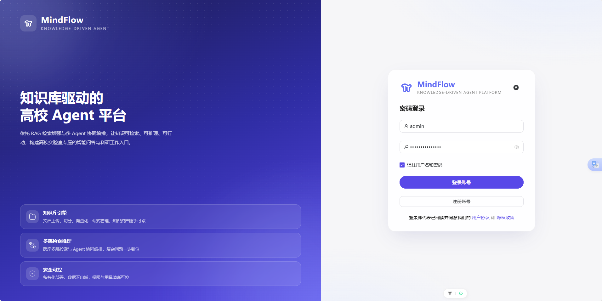
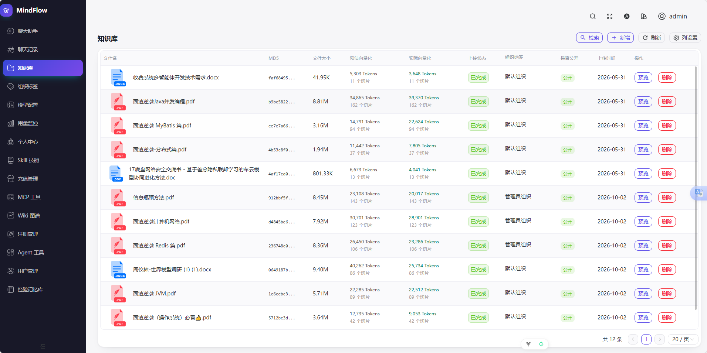
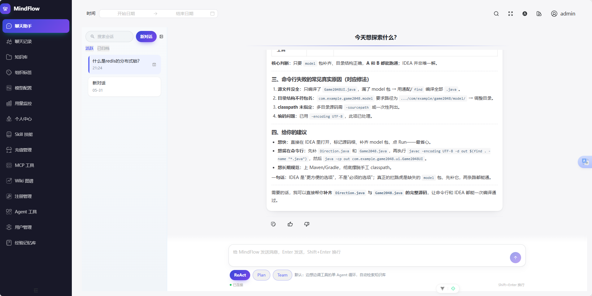
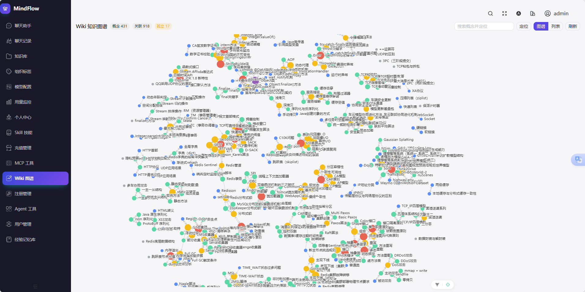
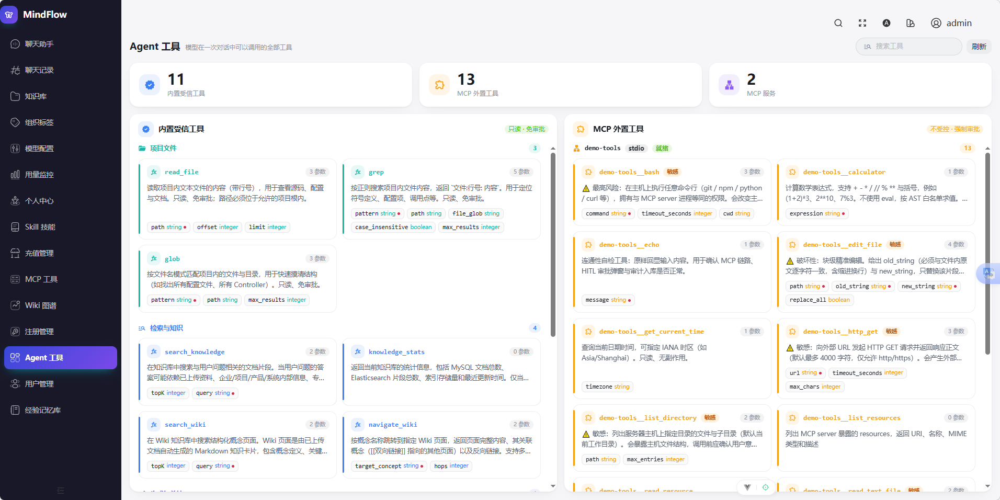
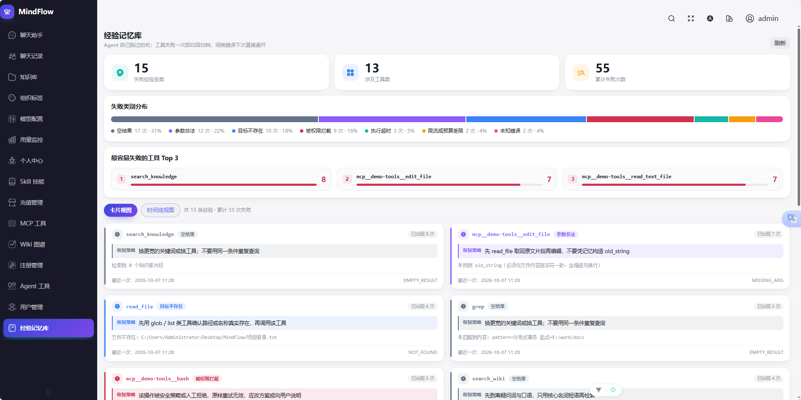
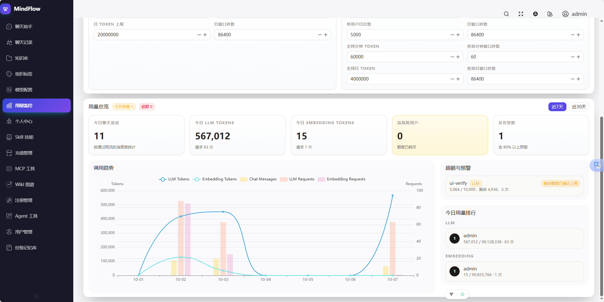

<div align="center">

# MindFlow

**知识库驱动的企业级 Agent 平台**
*Knowledge-base driven Agent platform — Agentic RAG × Wiki-RAG × Agent Harness*

让大模型带着「你的企业知识」去思考、去调用工具、去多步协作，并把每一步都**可审计、可回放、可治理**。

<!-- TODO: 在此放置一张项目主视觉/Banner 图，例如 docs/images/banner.png -->
<!--  -->

[](https://openjdk.org/)
[](https://spring.io/projects/spring-boot)
[](https://vuejs.org/)
[](LICENSE)

</div>

---

## 目录

- [它是什么](#它是什么)
- [为什么值得关注：六大亮点](#为什么值得关注六大亮点)
- [架构总览](#架构总览)
- [核心链路](#核心链路)
- [三种 Agent 范式](#三种-agent-范式)
- [工具与安全分层](#工具与安全分层)
- [技术栈](#技术栈)
- [项目结构](#项目结构)
- [快速开始](#快速开始)
- [配置开关](#配置开关)
- [测试与质量](#测试与质量)
- [界面展示](#界面展示)
- [许可](#许可)

---

## 它是什么

MindFlow 是一个把 **企业级 RAG 知识库** 与 **完整 Agent 引擎** 融合在一起的开源平台。它不是「把文档切块丢进向量库再做一次相似度检索」的玩具 RAG，而是围绕一个核心问题构建的系统：

> **如何让大模型在真实企业环境中，安全、可控、可追溯地自主使用知识、调用工具、完成多步任务？**

为此 MindFlow 分两层：

- **下层——知识底座（RAG 平台）**：文档解析、向量/关键词混合检索、结构化 Wiki 知识网络、多租户权限、Token 配额与计费。
- **上层——Agent 引擎（`harness`）**：ReAct 决策循环、Plan-and-Execute、Multi-Agent 协作、人工审批（HITL）、MCP 工具接入、技能（Skill）体系、长期记忆、全链路审计与轨迹回放。

系统允许用户：上传并自动处理各类文档、用自然语言查询知识库、查看带溯源与引用标注的 AI 回答、观察并审批 Agent 的每一次工具调用、以及用结构化的 Wiki 概念卡片浏览知识关联网络。

---

## 为什么值得关注：六大亮点

### 1️⃣ 双引擎检索：Agentic RAG × Wiki-RAG

传统 RAG 的文本块彼此孤立，难以支撑跨文档关联与多跳推理。MindFlow 用两个引擎互补：

- **Agentic RAG**：LLM 以 ReAct 范式**自主决定**何时检索、检索哪个信息源（原始文档片段 vs. Wiki 概念页），并把每轮的发现累积进「推理记忆」注入下一轮，形成真正的链式多跳推理。
- **Wiki-RAG**：文档入库时由 LLM 执行 **Map-Reduce 式知识编译**——Map 阶段分批抽取概念实体，Reduce 阶段全局合并去重，产出带 `[[双向链接]]` 的结构化 Markdown 知识网络，让「概念与概念的关系」成为一等公民。

### 2️⃣ 混合检索的克制工程

主链路两级收敛：**KNN 语义 + BM25 关键词并行召回**（各 50）→ **RRF 倒数排名融合**（k=60）取前 20 交给 LLM。多租户权限过滤直接下推到 ES `filter` 子句、不参与打分。LLM 精排（`RerankService`）**已完整实现但默认不接入主链路**——在当前知识规模下，额外一轮打分的延迟与配额成本高于收益，因此作为「一行即可接入」的扩展点保留。这种「知道何时不做」的取舍，体现的是工程判断力而非功能堆砌。

### 3️⃣ 三种 Agent 范式，前端一条斜杠命令切换

同一个聊天输入框，根据前缀自动切换到不同的执行范式，全部通过 WebSocket 事件流实时可视化：

| 输入 | 范式 | 行为 |
|---|---|---|
| 普通文本 | **ReAct** | 知识库优先检索 → LLM 自主决定工具调用 → 流式回答 |
| `/plan <任务>` | **Plan-and-Execute** | 生成 DAG 计划 → 弹窗审阅 → 批次并行执行（≤4）→ 失败且进度 <50% 自动重规划 |
| `/team <任务>` | **Multi-Agent** | 规划者 → 执行者×2（批次并行）→ 检查者（最多重试 2 次） |
| `/cancel` | — | 级联取消：LLM 流 / 工具批次 / 循环边界全部即时感知 |

### 4️⃣ 三层纵深的安全治理（L1 / L2 / L3）

Agent 能调用工具，就意味着必须回答「它会不会闯祸」。MindFlow 按**威胁模型**分层设防，而不是笼统加一个开关：

- **L1 规则过滤**（`ToolPolicyGateway` = `CommandGuard` + `PathGuard`）：破坏性命令黑名单 fast-fail、绝对路径越界 / `..` 穿越 / 符号链接逃逸围栏。**常驻生效**。
- **L2 人工审批**（HITL）：外置 `mcp__*` 工具强制审批，前端弹窗可**放行 / 改参 / 跳过 / 拒绝**，改后参数回炉 L1 复检。
- **L3 审计追溯**（`AuditLogService`）：JSONL 按天文件 + MySQL 双写，`Bearer/token/key/password/secret` 落盘前自动脱敏，写失败仅告警不阻断主流程。

内置工具全部只读或仅写自有存储（不具备文件系统/shell 能力），防御重心精准锁定外置 MCP 工具。

### 5️⃣ 把「Agent 黑盒」变成「可观测、可回放」

- **全链路轨迹落库回放**：每一次问答的 Agent 执行轨迹（轮次、工具调用、耗时、token）编码持久化，历史页可完整回放推理过程。
- **长期记忆**：用户说「记一下」即触发 `save_memory` 入库，并在后续每轮对话自动注入相关记忆上下文。
- **技能（Skill）三级披露**：`data/skills/<name>/SKILL.md` 目录化存储，磁盘 + MySQL 双写；按需渐进披露，脚本只读不执行。
- **MCP 生态接入**：兼容 Claude Desktop 的 `mcp.json` 格式，支持 stdio 与 Streamable HTTP 两种传输；无配置文件即 no-op。

### 6️⃣ 企业级底座开箱即用

多租户组织标签与权限隔离、用户/组织级 Token 配额（每日重置或总量消费两种策略）、Redis 限流、微信支付充值、JWT 认证、Spring Security 组织权限过滤器——不是「以后再说」的 TODO，而是已经在跑的模块。

---

## 架构总览

<!-- TODO: 在此放置整体架构图，例如 docs/images/architecture.png -->
<!--  -->

```
┌───────────────────────────────────────────────────────────┐
│                     Vue 3 + TS 前端 (Naive UI)              │
│   chat / chat-history / wiki-graph / skill / mcp-config ...  │
└───────────────────────────┬───────────────────────────────┘
                            │  WebSocket 协议 v2 + REST
┌───────────────────────────┴───────────────────────────────┐
│                    Agent 引擎层 (com.mindflow.harness)       │
│  ReAct · Plan-Execute · Multi-Agent · HITL · MCP · Policy    │
│  Memory(长期记忆/历史压缩) · Skill · Audit(审计双写)          │
└───────────────────────────┬───────────────────────────────┘
                            │
┌───────────────────────────┴───────────────────────────────┐
│                     知识底座层 (RAG 平台)                     │
│  Auth · Document · Search(混合检索) · Wiki · Chat · Usage     │
│  Organization · Recharge · Admin · Memory · Skill · MCP ...  │
└───────────────────────────┬───────────────────────────────┘
                            │
┌───────────────────────────┴───────────────────────────────┐
│  MySQL  │  Redis  │  Elasticsearch  │  Kafka  │  MinIO  │ LLM │
└───────────────────────────────────────────────────────────┘
```

**分层原则**：控制层只做请求校验与编排；服务层承载业务逻辑并协调 MySQL/ES/MinIO/Redis/Kafka 多数据源；AI 层由 `LlmProviderRouter` 统一路由（DeepSeek / Ollama / 阿里云）、`AgentToolRegistry` 注册所有可调用工具；`harness` 作为独立引擎层可单独演进，不与业务模块耦合。

---

## 核心链路

### 文档上传 → Wiki 知识网络构建

```
用户上传分片 → MinIO(chunks/) → 合并 → MinIO(merged/) → 发送 Kafka 消息
  → FileProcessingConsumer 消费
  → Apache Tika 解析 + 分块 → MySQL(document_vectors)
  → Embedding 向量化 → Elasticsearch(knowledge_base 索引)
  → WikiExtractionService（Map 分批抽取概念 → Reduce 合并去重）
  → 写入 data/wiki/*.md + 处理 [[双向链接]]
```

### Agentic RAG 问答链路

```
用户输入
  → QueryRewriteService（敏感检测 → 意图分类 → 查询改写）
  → ReActAgentService 决策循环（LLM 自主退出 + 三重保险阀）
     ├─ 第 N 轮：调 LLM → 返回 tool_calls
     │    ├─ search_knowledge / search_wiki / generate_summary / ...
     │    └─ ParallelToolRunner 并行批次（≤4 / 90s 超时 / 结果按序回灌）
     │         → 经 L1 PolicyGateway → L2 HITL → L3 Audit
     ├─ 推理记忆累积 → 注入下一轮上下文
     └─ 无 tool_calls → 生成最终回答 → WebSocket 流式推送 + 引用溯源
```

---

## 三种 Agent 范式

见 [亮点 3](#3-三种-agent-范式一条斜杠命令切换)。三种范式共享同一套工具执行链与安全分层，区别只在**决策拓扑**：ReAct 是单循环自退出，Plan 是「先出 DAG 再批次并行 + 审阅 + 自动重规划」，Team 是「规划-执行-检查」三角色流水线。WebSocket 协议 v2 为纯增量设计——后→前推送 `plan_review`/`plan_step`/`plan_status`/`team_event`/`approval_request`/`memory_saved`，前→后回传审阅与审批决策，所有消息携带 `generationId + conversationId` 以支持多标签页按代次路由，前端对未知 `type` 静默忽略，向后兼容。

---

## 工具与安全分层

| 层 | 组件 | 职责 | 开关 |
|---|---|---|---|
| L1 规则过滤 | `ToolPolicyGateway`（`CommandGuard` + `PathGuard`） | 破坏性命令黑名单、路径越界/穿越/软链逃逸围栏 | `mindflow.policy.guard.enabled`（**常驻**） |
| L2 人工审批 | `ApprovalPolicy` + `HitlToolRegistry` | MCP 工具强制审批，WS 推 `approval_request`，可放行/改参/跳过/拒绝 | `mindflow.hitl.enabled` |
| L3 审计追溯 | `AuditLogService` | JSONL 按天 + MySQL `audit_logs` 双写，敏感参数落盘前脱敏 | 常开 |

内置工具：`search_knowledge`、`search_wiki`、`navigate_wiki`、`generate_summary`、`submit_feedback`、`knowledge_stats`、`save_memory`、`load_skill` 等——全为只读检索或仅写自有存储。

---

## 技术栈

### 后端

| 类别 | 技术 | 版本 |
|------|------|------|
| 语言 / 框架 | Java / Spring Boot | 21 / 3.4.2 |
| 数据库 / ORM | MySQL 8.0 / Spring Data JPA | - |
| 缓存 / 会话 | Redis | 7.0.11 |
| 检索 / 向量 | Elasticsearch | 8.10.0 |
| 消息队列 | Apache Kafka | 3.2.1 |
| 对象存储 | MinIO | 8.5.12 |
| 文档解析 / 分词 | Apache Tika / HanLP | 2.9.1 / portable-1.8.6 |
| 安全 | Spring Security + JWT | jjwt 0.11.5 |
| AI | DeepSeek / 阿里云 DashScope Embedding | - |
| 实时 / 响应式 | WebSocket / Spring WebFlux | - |
| 构建 | Maven | - |

### 前端

Vue 3 + TypeScript · Vite · Naive UI · Pinia · Vue Router · UnoCSS + SCSS · Iconify · pnpm（monorepo）

---

## 项目结构

### 后端 `src/main/java/com/mindflow/`

```
com/mindflow/
├── MindFlowApplication.java        # 主入口
├── client/                          # DeepSeek / Embedding 客户端
├── config/                          # ES / Kafka / MinIO / Redis / Security / Web / 初始化器
├── harness/                         # ★ Agent 引擎（本项目的核心增量）
│   ├── execute/                     #   AgentBudget · ParallelToolRunner · PlanExecute · SubAgent(Multi-Agent)
│   ├── plan/                        #   Planner · ExecutionPlan · Task（DAG 计划）
│   ├── hitl/                        #   ApprovalPolicy · HitlToolRegistry（L2 人工审批）
│   ├── mcp/                         #   McpClient/Server/Manager · transport(Stdio/StreamableHttp) · jsonrpc · protocol · resources
│   ├── policy/                      #   CommandGuard · PathGuard · ToolPolicyGateway（L1）· AuditLogService（L3）
│   ├── memory/                      #   ConversationHistoryCompactor · TokenBudget · HistoryDigest
│   └── skill/                       #   Skill · SkillRegistry · 三级披露
├── module/                          # 业务模块（controller/service/repository/entity 分层）
│   ├── auth · document · search · wiki · chat                # RAG 核心
│   ├── organization · admin · recharge · usage              # 企业底座
│   └── audit · memory · skill · mcp                         # harness 能力的持久化 + REST 侧
│       └── chat/service/ReActAgentService · ReasoningMemoryService · ChatOrchestrationService
│       └── chat/agent/AgentToolRegistry · AgentToolExecutor
├── structure/                       # LlmProviderRouter · FileProcessingConsumer
└── utils/
```

### 前端 `frontend/`

```
frontend/
├── packages/       # 可复用模块（axios、hooks、utils 等）
└── src/
    ├── views/      # chat / chat-history / wiki-graph / skill / mcp-config / agent-tool
    │              # model-provider / org-tag / personal-center / usage-monitor / recharge-manage ...
    ├── components/ · layouts/ · router/（含守卫）· service/（API）· store/（Pinia）
    └── hooks/ · locales/ · styles/ · theme/
```

---

## 快速开始

### 0. 前置环境

Java 21 · Maven 3.9+ · Node ≥ 18.20（推荐 22.12.0）/ pnpm ≥ 8.7 · MySQL 8.0 · Elasticsearch 8.10 · Redis 7 · Kafka 3.2 · MinIO · Docker（可选，起基础设施）

### 1. 准备配置

```bash
cp .env.example .env
```

`.env` 包含 MySQL/Redis/Kafka/MinIO/ES/JWT/AI Provider 配置。关键项：

- `SPRING_PROFILES_ACTIVE=dev`
- `JWT_SECRET_KEY` — Base64 密钥，可用 `openssl rand -base64 32` 生成
- `ADMIN_BOOTSTRAP_ENABLED=true` — 首次启动创建管理员，创建成功后改回 `false`
- `DEEPSEEK_API_KEY` / `EMBEDDING_API_KEY` — 填入你的大模型与向量服务密钥

### 2. 启动基础设施

```bash
docker compose -f docs/docker-compose.yaml up -d
```

启动后手动在 MinIO 控制台（`http://localhost:19001`）创建 `uploads` bucket。

### 3. 启动后端

```bash
mvn spring-boot:run
# 或 IDE 直接运行 com.mindflow.MindFlowApplication（自动读取根目录 .env）
```

后端监听 `8081`。

### 4. 启动前端

```bash
cd frontend && pnpm install && pnpm dev
```

访问 `http://localhost:9527`，API 经 Vite 代理到 `http://localhost:8081/api/v1`。

### 5. 试用三种 Agent 范式

登录后进入聊天页，分别发送：

- `什么是 CAP 理论？` → ReAct 流式回答 + 引用溯源
- `/plan 总结知识库中的核心概念` → 计划弹窗审阅 → 批次并行执行 → 进度可视化
- `/team 对比 X 与 Y 两个概念` → 规划者/执行者/检查者协作事件流

---

## 配置开关

`application.yml` 的 `mindflow:` 段控制 Agent 引擎行为（均有默认值）：

```yaml
mindflow:
  react:      # max-rounds 10 / max-tool-calls 8 / stagnation-window 3（三重保险阀）
  tool:       # parallelism 4 / batch-timeout-seconds 90
  plan:       # review-timeout-seconds 300（审阅超时自动按取消收回）
  hitl:       # enabled false（安全默认）/ approval-timeout-seconds 120
  mcp:        # enabled true / config-path / project-dir
  audit:      # dir data/audit
  policy:     # guard.enabled true（L1 常驻）/ path-enabled / root
```

---

## 测试与质量

- **harness 引擎有真实单元测试覆盖**：MCP 传输（Stdio/Streamable HTTP）、JsonRPC、HITL、CommandGuard/PathGuard、Skill 解析、Plan/Multi-Agent、审计等均有对应测试。
- **`@SpringBootTest` 集成测试需要真实基础设施**（MySQL/Redis/ES/Kafka/MinIO）；在没有这些服务的机器上会失败，属预期基线，配齐依赖后可全绿。
- 定向编译：`mvn -q -DskipTests compile`；运行测试：`mvn test`。
- 前端类型检查：`pnpm typecheck`；定向 lint：`pnpm exec eslint <file>`。

---

## 界面展示

> 下列截图均来自 `docs/images/`，展示从登录、知识库到 Agent 能力的完整闭环。

<div align="center">
  
  <br><b>登录</b> · JWT 认证 + 多租户组织权限
</div>

<div align="center">
  
  <br><b>知识库管理</b> · 文档上传 / 分片解析 / 向量索引
</div>

<div align="center">
  
  <br><b>智能问答</b> · ReAct 流式回答 + 引用溯源 + 工具调用可视化
</div>

<div align="center">
  
  <br><b>Wiki-RAG 知识图谱</b> · 概念实体与双向链接网络
</div>

<div align="center">
  
  <br><b>Agent 工具与安全分层</b> · L1 规则 / L2 审批 / L3 审计
</div>

<div align="center">
  
  <br><b>长期记忆</b> · save_memory 入库 + 每轮上下文注入
</div>

<div align="center">
  
  <br><b>Token 配额与用量</b> · 每日重置 / 总量消费两种策略
</div>

---

## 许可

本项目基于 [Apache License 2.0](LICENSE) 开源。